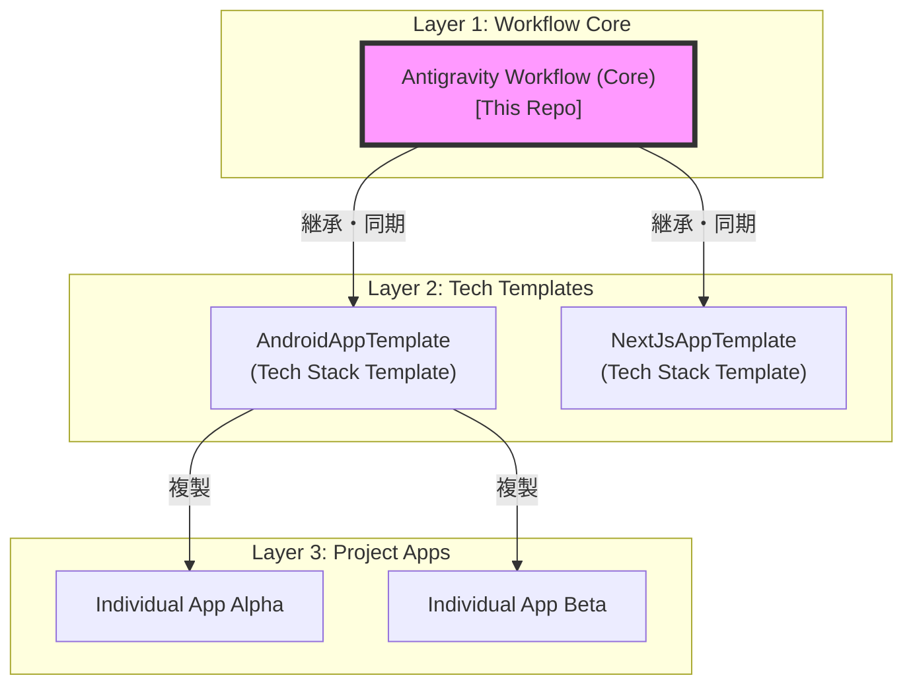

# Antigravity Workflow

このリポジトリは、AI エージェント Antigravity が GitHub 上で自律的に開発タスクを実行するための標準ワークフローと設定を定義する基盤リポジトリです。

---

## プロジェクトの立ち位置 (Ecosystem)

本リポジトリは、すべての開発プロジェクトの最下層に位置する「共通の作法」を定義します。
技術スタック固有のルールは持たず、Issue 管理、ブランチ運用、進捗の保存・再開といった **「AI と人の協働プロセス」** に特化しています。



---

## 提供する主要機能 (Key Features)

### 1. タスクとコンテキストの自律管理
- **進捗の保存・復元 (`/save`, `/resume`)**: AI が現在の中断状態を Issue に「栞（しおり）」として残し、別の環境やタイミングでも即座に文脈を復元して再開できます。
- **環境クリーンアップ (`/cleanup`)**: 作業完了後のマージ済みブランチやラベルを一括で整理します。

### 2. プロジェクトの標準化
- **初期セットアップ (`/setup`)**: テンプレートから作成した新規プロジェクトを、数秒で開発可能な状態に構成します。
- **ルール同期 (`/sync-rules`)**: 本リポジトリ（Core）で改善された最新のワークフローを、既存の各プロジェクトへ安全に取り込めます。

### 3. ガードレール
- **ブランチ保護**: `main` ブランチへの直接プッシュをフックで制限し、常に Pull Request ベースの安全な開発を強制します。

---

## 使い方 (Usage)

### 1. 導入 (Installation)

#### A. テンプレートプロジェクト（Layer 2）の開発
本リポジトリをテンプレートとして使用、または内容をコピーして、特定の技術スタック（例：Android, Vite）向けの標準設定を追加したテンプレートリポジトリを構築してください。

#### B. 既存プロジェクトへの同期
AI エージェントに対して以下のコマンドを実行し、最新のワークフローを取り込みます。
> `/sync-rules`

### 2. 初期セットアップ
プロジェクト開始直後（またはテンプレートから作成直後）に AI に以下のコマンドを指示してください。
> `/setup`

これに続いて、以下のスクリプトを実行して GitHub ラベルとローカルフックを有効化することを推奨します。

```powershell
./scripts/win/setup-labels.ps1
./scripts/win/setup-hooks.ps1
```

---

## ディレクトリ構造 (Structure)

```text
├── .antigravityrule       <-- AI エージェントの動作指針・ルール目次
├── .agent/                <-- AI 向けの規約・ワークフロー定義
│   ├── rules/             <-- コア規約 (Workflow, Git, GitHub)
│   ├── templates/         <-- 初期化用テンプレート (roadmap.md 等)
│   └── workflows/         <-- 自動化コマンド (/save, /resume 等)
├── .github/               <-- 共通の GitHub 設定 (Issue/PR テンプレート)
├── .vscode/               <-- VS Code 設定 (AI へのコマンド実行許可)
├── docs/99_progress/      <-- 進捗管理 (roadmap.md)
└── scripts/               <-- 環境構築用スクリプト
```

| 主要ファイル | 役割 |
| :--- | :--- |
| `.antigravityrule` | エージェントへの最優先指示。日本語指定とルールインデックス。 |
| `.agent/rules/01_workflow.md` | Issue と PR を活用した開発サイクルの詳細定義。 |
| `.agent/rules/02_git.md` | コミットメッセージ、ブランチ運用等の Git 標準ルール。 |
| `.agent/rules/03_github.md` | PR の書き方、自動化、ラベル運用のルール。 |
| `.agent/workflows/` | `/setup`, `/save`, `/resume` 等の具体的実行手順。 |

---

## フィードバックと還元 (Contributing)

プロジェクトでの利用中に、汎用的に使える優れたワークフローの改善案を発見した場合は、ぜひ本リポジトリへフィードバックしてください。

1. 本リポジトリに Issue を作成し、改善を提案する。
2. 固有名詞を排除した汎用的な形で Pull Request を作成する。

詳細は [CONTRIBUTING.md](./CONTRIBUTING.md) を参照してください。
