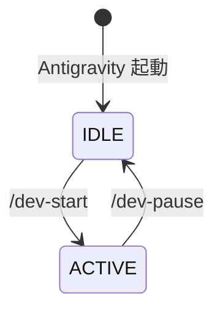
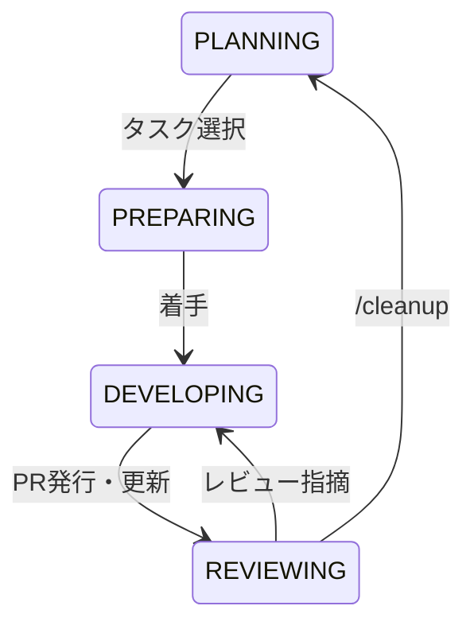

# 状態遷移 (State Machine)

本ドキュメントでは、エージェントの大きな稼働状態（モード）と、その内部での細かいフェーズ（状態）の遷移管理を定義します。

---

## 1. IDLE - ACTIVE 状態

システム起動時、およびコンテキストのロード/セーブによる、大枠のモード切り替えです。

### 状態遷移図

### 状態定義

|状態|説明|
|:---|:---|
|IDLE|通常チャット・会話モード|
|ACTIVE|開発・ワークフローモード|

---

## 2. ACTIVE 内部状態 (フェーズ)

ACTIVE モード内では、GitHub flow に準拠した 4 つのフェーズを順番に、あるいはループで遷移します。

### 状態遷移図

### 状態定義

|状態|説明|
|:---|:---|
|PLANNING|`roadmap.md` を管理し、次に着手するタスク(Issue)を確定させる。|
|PREPARING|ブランチ作成、切り替え。|
|DEVELOPING|実装ループ(コード修正→テスト→コード修正→...)の自律試行錯誤。|
|REVIEWING|PR発行、ユーザーレビュー、およびマージ後の後処理（`/cleanup`）。|
