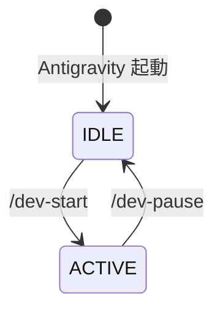
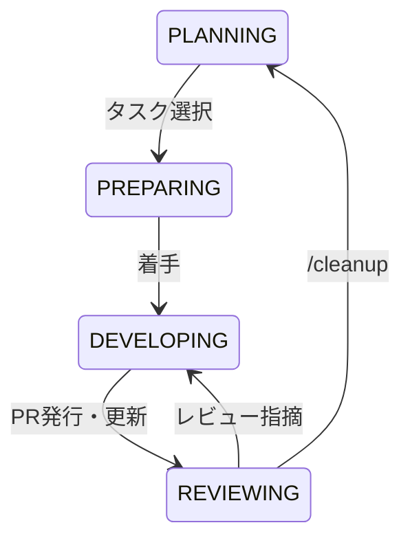

# antigravity-workflow

このリポジトリは、AI エージェント Antigravity が GitHub 上で自律的に開発を実行するための標準ワークフロー（GitHub flow 準拠）と設定を提供する基盤です。

---

## 🛠️ 1. 初期セットアップ方法 (Initial Setup)

新しいプロジェクトにこの開発ワークフローを導入する手順です。

1. **ワークフローファイルのコピー**:
   - 本リポジトリの `.agent/workflows/setup-workflow.md` を、対象プロジェクトの `.agent/workflows/setup-workflow.md` へコピーします。
2. **AI エージェントへの指示**:
   - チャットで **`/setup-workflow`** の実行を指示してください。
   - ※自動的に最新の共通規約、Git フック、GitHub ラベル等がインストール・構成されます。

> [!TIP]
> 導入後は、**`/sync-workflow`** を定期的に実行するだけで、本リポジトリ側で改善された最新のワークフローを反映できます。

---

## 🧭 2. 開発の進め方・指示の出し方 (Development Cycle)

ユーザー（あなた）は大まかな方向だけを指示し、コマンドの詳細や安全性の検証は AI がスキル（自動操縦マニュアル）を読み込んで自律的に実施します。

### 📥 2-A. アイデア・要望の出し方 (`backlog.md`)

ユーザー（あなた）が「将来的にやりたいこと」や「ざっくりしたアイデア」を思いついたときは、**`docs/status/backlog.md`** に箇条書きでメモを残してください。

- **書き場所**: 「📥 未分類の要望 (Unsorted Ideas)」の最下部
- **AI の挙動**: エージェントは `PLANNING` フェーズでこのファイルを自動的にチェックし、要件定義とタスク分解を挟んで `roadmap.md`（ロードマップ）へ反映・提案します。

---

## 1. IDLE - ACTIVE 状態

システム起動時、およびコンテキストのロード/セーブによる、大枠のモード切り替えです。

### 状態遷移図



### 状態定義

|状態|説明|
|:---|:---|
|IDLE|通常チャット・会話モード|
|ACTIVE|開発・ワークフローモード|

---


---

### 🌿 ブランチ戦略 (GitHub Flow の適用)

ACTIVE モード内の実作業（フェーズ遷移）では、裏側で **GitHub Flow** に基づく安全なトピックブランチ運用を実践しています。

| ステップ | 実行されるアクション |
| :--- | :--- |
| **開く (Open)** | `PREPARING` フェーズで `main` からブランチ（例: `123-feature-name`）を作成。 |
| **共有 (Share)** | 早期に **Draft PR** を発行し、作業進捗をリアルタイムに視覚化（共有）します。 |
| **実装 (Commit)** | `DEVELOPING` フェーズでコードを追加。PR 上で自律的な試行錯誤を行います。 |
| **最終化 (Final)** | `REVIEWING` フェーズで **`Ready for review`** へ移行（Draft解除）します。 |
| **統合 (Merge)** | ユーザーによるマージ完了後、**`/cleanup`** で安全にブランチを自動削除します。 |

---

## 2. ACTIVE 内部状態 (フェーズ)

ACTIVE モード内では、タスクのライフサイクルに沿った 4 つのフェーズを順番に遷移します。

### 状態遷移図



### 状態定義

|状態|説明|
|:---|:---|
|PLANNING|`roadmap.md` を管理し、次に着手するタスク(Issue)を確定させる。|
|PREPARING|ブランチ作成、切り替え。|
|DEVELOPING|実装ループ(コード修正→テスト→コード修正→...)の自律試行錯誤。|
|REVIEWING|PR発行、ユーザーレビュー、およびマージ後の後処理（`/cleanup`）。|

---

## 🔧 3. ルールの更新・カスタマイズ (Customization)

プロジェクト専用の言語・技術スタックに合わせたルールの追加方法です。

- **プロジェクト固有ルールの追加 (Custom)**:
  - **`.agent/custom/`** 配下に Markdown（`.md`）で規約ファイルを配置してください。
  - AI エージェントは自動的に読み込み、最優先の独自ルール（Local Context）として自動適用します。
- **共通ルールの更新**:
  - ルートの `.antigravityrule` や `.agent/rules/` の改善は、共通基盤へのフィードバック還元をお願いします。

---

## 📂 ディレクトリ構造 (Structure)

```text
├── .antigravityrule       <-- AI エージェントの動作全体の指針とインデックス
├── .agent/
│   ├── rules/             <-- 共通規約 (/sync-workflow で同期される)
│   ├── custom/            <-- 各プロジェクト固有規約 (同期対象外)
│   ├── templates/         <-- Issue / PR 向けのテンプレート群
│   ├── workflows/         <-- Slash コマンド群 (/dev-pause, /dev-start, /cleanup 等)
│   └── skills/            <-- 各種タスクの自律実行手順 (flow-kickoff, github-pr 等)
├── .github/               <-- 共通 Issue テンプレート等
├── .vscode/               <-- VS Code 設定 (autoApprove 設定含む)
└── docs/status/           <-- 進捗管理 (roadmap.md, backlog.md)
```
