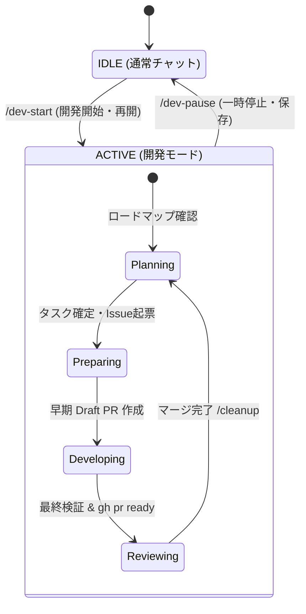

# antigravity-workflow

このリポジトリは、AI エージェント Antigravity が GitHub 上で自律的に開発を実行するための標準ワークフロー（GitHub flow 準拠）と設定を提供する基盤です。

---

## 🛠️ 1. 初期セットアップ方法 (Initial Setup)

新しいプロジェクトにこの開発ワークフローを導入する手順です。

1. **ワークフローファイルのコピー**:
   - 本リポジトリの `.agent/workflows/setup-workflow.md` を、対象プロジェクトの `.agent/workflows/setup-workflow.md` へコピーします。
2. **AI エージェントへの指示**:
   - チャットで **`/setup-workflow`** の実行を指示してください。
   - ※自動的に最新の共通規約、Git フック、GitHub ラベル等がインストール・構成されます。

> [!TIP]
> 導入後は、**`/sync-workflow`** を定期的に実行するだけで、本リポジトリ側で改善された最新のワークフローを反映できます。

---

## 🧭 2. 開発の進め方・指示の出し方 (Development Cycle)

ユーザー（あなた）は大まかな方向だけを指示し、コマンドの詳細や安全性の検証は AI がスキル（自動操縦マニュアル）を読み込んで自律的に実施します。

### 📥 2-A. アイデア・要望の出し方 (`backlog.md`)

ユーザー（あなた）が「将来的にやりたいこと」や「ざっくりしたアイデア」を思いついたときは、**`docs/status/backlog.md`** に箇条書きでメモを残してください。

- **書き場所**: 「📥 未分類の要望 (Unsorted Ideas)」の最下部
- **AI の挙動**: エージェントは `PLANNING` フェーズでこのファイルを自動的にチェックし、要件定義とタスク分解を挟んで `roadmap.md`（ロードマップ）へ反映・提案します。

---

### 📊 モードと状態遷移 (State Transitions)



### 🔄 基本的なサイクルと指示の例

| フェーズ（状態） | あなた（ユーザー）の指示例 | AI エージェントの自律稼働 |
| :--- | :--- | :--- |
| **1. 計画・着手** | **`roadmap.md から次のタスクを選んで着手して`** | ・Issueの特定/新規起票<br>・ブランチ作成（Issue紐付け）<br>・空Commit ＆ **Draft PR** 作成 |
| **2. 実装ループ** | ※通常は自律的に実装やテストを行います。<br>中断時: **/dev-pause** / 再開時: **/dev-start** | ・`task.md` での極小ステップ分解管理<br>・都度のテスト ＆ コミット<br>・中断時のCheckpoint（栞）投稿 |
| **3. 最終化** | (実装ループが完了するとAIが報告します) | ・最終動作検証<br>・`roadmap.md` の完了マーク<br>・`gh pr ready` (Draft解除) |
| **4. 後処理** | **/cleanup** | ・安全確認後のブランチ削除 |

---

## 🔧 3. ルールの更新・カスタマイズ (Customization)

プロジェクト専用の言語・技術スタックに合わせたルールの追加方法です。

- **プロジェクト固有ルールの追加 (Custom)**:
  - **`.agent/custom/`** 配下に Markdown（`.md`）で規約ファイルを配置してください。
  - AI エージェントは自動的に読み込み、最優先の独自ルール（Local Context）として自動適用します。
- **共通ルールの更新**:
  - ルートの `.antigravityrule` や `.agent/rules/` の改善は、共通基盤へのフィードバック還元をお願いします。

---

## 📂 ディレクトリ構造 (Structure)

```text
├── .antigravityrule       <-- AI エージェントの動作全体の指針とインデックス
├── .agent/
│   ├── rules/             <-- 共通規約 (/sync-workflow で同期される)
│   ├── custom/            <-- 各プロジェクト固有規約 (同期対象外)
│   ├── templates/         <-- Issue / PR 向けのテンプレート群
│   └── workflows/         <-- Slash コマンド群 (/dev-pause, /dev-start, /cleanup 等)
├── .github/               <-- 共通 Issue テンプレート等
├── .vscode/               <-- VS Code 設定 (autoApprove 設定含む)
└── docs/status/           <-- 進捗管理 (roadmap.md, backlog.md)
```
