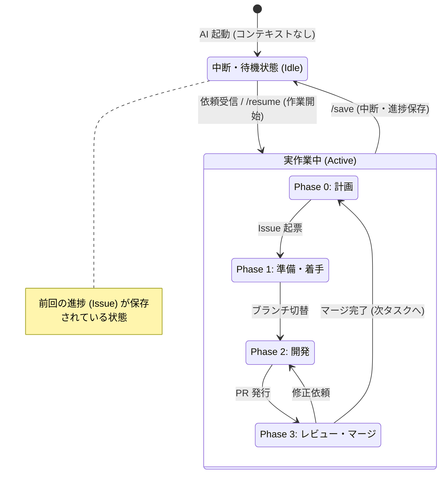
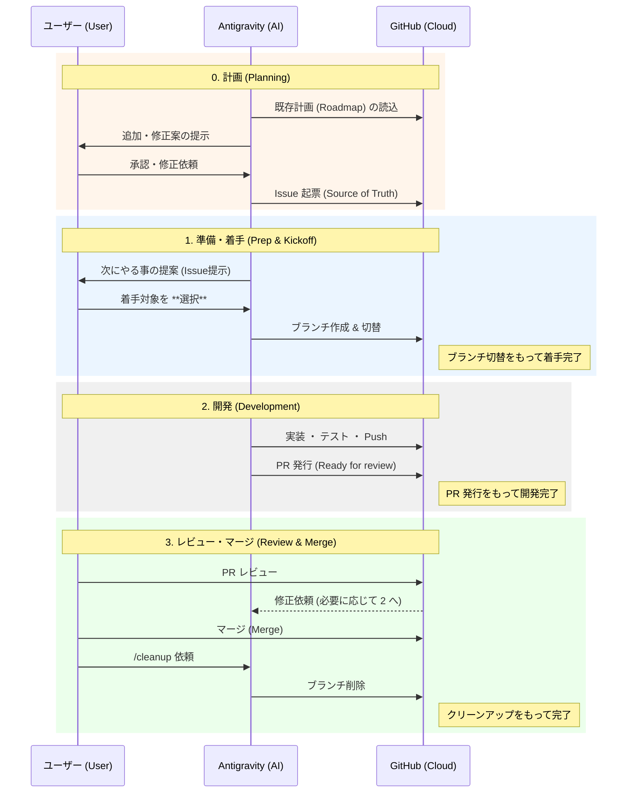
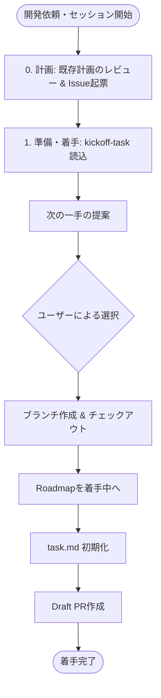
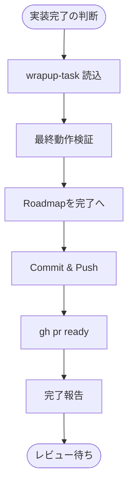

# 開発ワークフロー設計書 (Development Workflow Design)

本リポジトリにおける開発のライフサイクル、AI Skill の役割、およびコンテキスト継続性の設計思想を定義します。

## 1. 全体状態遷移 (Overall State Transitions)

プロジェクトのライフサイクルにおける各フェーズの状態変化と、中断・再開 (`/save`, `/resume`) を含むフローです。

## 2. 全体ライフサイクル (Lifecycle Overview)

登場人物間のやり取りを中心とした、時間軸での概要シーケンスです。

## 3. 着手フロー (Kickoff Flow)

`kickoff-task` Skill が担う、作業開始時の詳細な論理フローです。

## 4. 完了フロー (Wrapup Flow)

`wrapup-task` Skill が担う、品質確保と最終化の詳細なフローです。

## 5. 設計上の重要原則

1. **GitHub Issue as the Source of Truth**: 設計判断やタスクリストの詳細は常に Issue に集約され、AI の `task.md` はその一時的な写しに過ぎません。
2. **Early Draft PR**: コードの透明性を保つため、最初の Commit 直後に Draft PR を作成します。
3. **Skill-Driven Execution**: 複雑な手順は Skill (`SKILL.md`) にカプセル化し、実行時の安定性を担保します。
