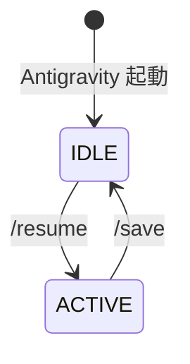
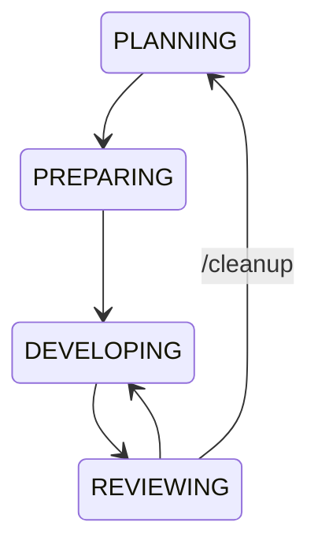
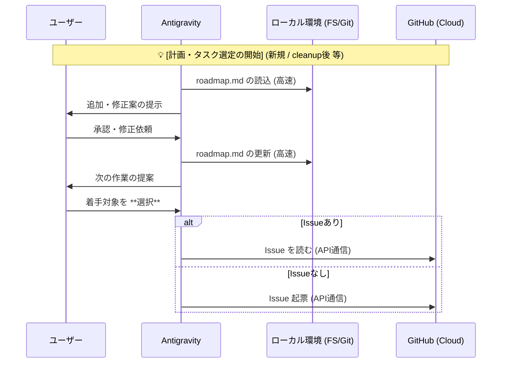
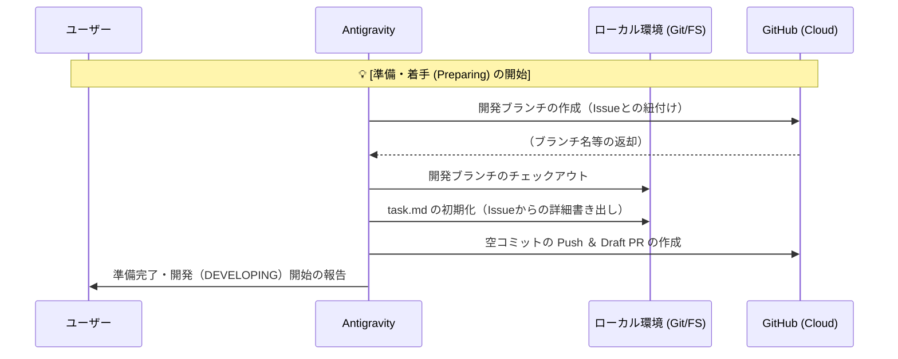
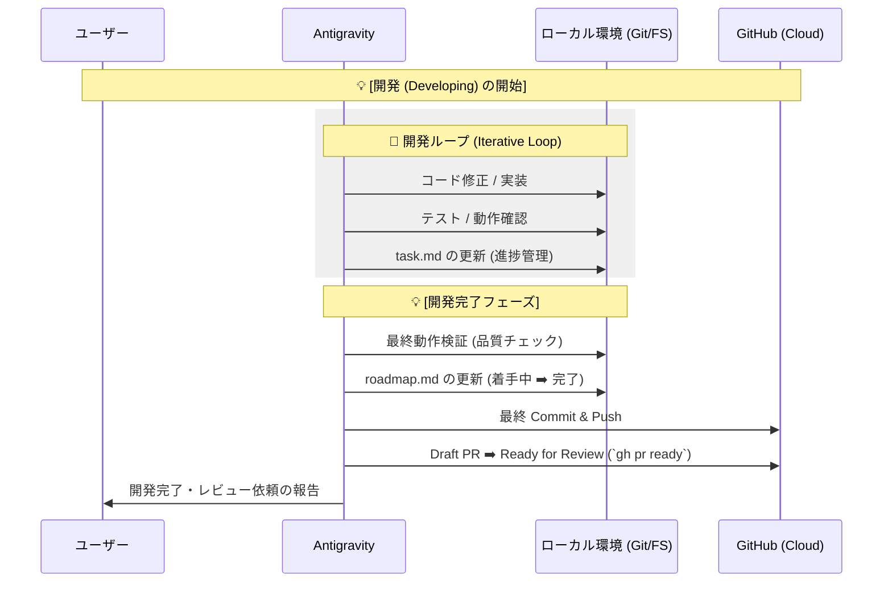
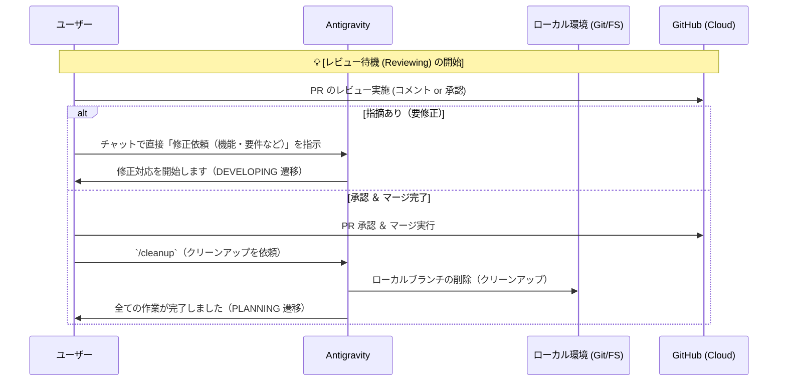
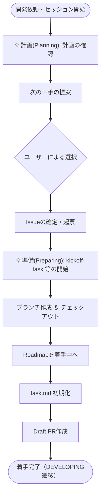
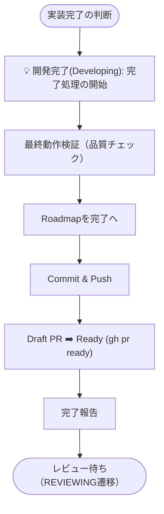

# 開発ワークフロー設計書 (Development Workflow Design)

本リポジトリにおける開発のライフサイクル、AI Skill の役割、およびコンテキスト継続性の設計思想を定義します。

## 1. 設計上の重要原則

以下に、ワークフローを支える 5 つの原則をまとめます。

| 原則 | 概要 / 目的 | 運用イメージ / 詳細 |
| :--- | :--- | :--- |
| **⚖️ 1. Dual Source of Truth** | マクロ（全体）とミクロ（タスク）の分離 | ・**Roadmap**: 全体ゴール、進捗管理 ・**Issue**: 各タスクの詳細仕様、議論の記録 |
| **📂 2. Early Draft PR** | 作業プロセスの透明化・可視化 | 最初の Commit 直後に Draft PR を作成し、ブラックボックス化を防止 |
| **🛠️ 3. Skill-Driven Execution** | 定型作業の自動化 ＆ 思考の柔軟性確保 | 機械的作業は Skill、実装や計画は AI の試行錯誤に分担 |
| **⚡ 4. Local-First Context** | 高速なレスポンス ＆ 確実なバックアップ | 進捗はローカル（`task.md`）で高速管理、適宜 GitHub に保存 |
| **📝 5. Audit Trail** | 指摘対応の履歴・コンテキストの維持 | チャット指示による修正も、必ず PR コメントに足跡を残す |

---

### 💡 補足：Skill-Driven Execution の区分

定型作業（Mechanical）と柔軟な作業（Intelligence）を以下のように区分し、安定性・効率を両立します。

| 区分 | 特徴 / 目的 | 具体的な対象 |
| :--- | :--- | :--- |
| **Skill化 (ガードレール)** | バグが許されない、手順の強制が必須な領域 | ・**PREPARING**: `kickoff-task` ・**DEVELOPING**: `wrapup-task` ・**CLEANUP**: `/cleanup` ・**状態同期**: `/save`, `/resume` |
| **AI の自律 (柔軟・試行錯誤)** | チャットのやり取りや臨機応変な実装・デバッグ | ・**PLANNING**: 計画・発案 ・**DEVELOPING**: 実装ループ |

## 2. 状態遷移

### 1-1. IDLE - ACTIVE 状態

- 状態
  - `IDLE`: 起動直後の、コンテキストが失われた状態
  - `ACTIVE`: コンテキストが継続している状態
- アクション
  - `/resume`: 中断状態から作業を再開する
  - `/save`: 作業を中断し、進捗を保存する 

### 1-2. ACTIVE 状態

- ACTIVE 状態は大きく以下の 4 状態を遷移する
- `/resume` 時に、4 状態のどこから再開するかを判断し、そこから再開する

- `PLANNING`: タスクリストを管理し、次の作業を決める
- `PREPARING`: 次の作業を開始するための準備を行う
- `DEVELOPING`: 開発を行う
- `REVIEWING`: PR を発行し、ユーザーによるレビューを受ける

### 1-3. PLANNING 状態（計画・タスク選定シーケンス）

- 目的
  - 次にするタスク（Issue）を確定させる
- 注記
  - `/resume` 実行時は、直前のチェックポイント（Checkpoint）に応じて各状態（Developing等）に直接復帰することもありますが、本図は **Planning から再開（または新規計画）時の流れ** を示します。

### 1-4. PREPARING 状態

- 目的
  - 実装作業（DEVELOPING）へスムーズに移行するための環境を整える
- **ブランチ作成の方針**
  - **GitHub-First**: Issue との強固な紐づけ（Traceability）を担保するため、ブランチは `gh` コマンド等を利用して **GitHub 上で先に発行** し、それをローカルにチェックアウトするフローを採用します。

### 1-5. DEVELOPING 状態

- 目的
  - Issue の要件を満たす実装を完成させ、レビューを依頼する

### 1-6. REVIEWING 状態

- 目的
  - ユーザーのレビューを受け、指摘対応またはクリーンアップを行う

## 3. 詳細実行フロー（Skill手順）

### 3-1. 着手フロー (Kickoff Flow)

`kickoff-task` Skill 等が担う、作業開始時の詳細な論理手順です。

### 3-2. 完了フロー (Wrapup Flow)

`wrapup-task` Skill 等が担う、品質確保と最終化の詳細な手順です。

